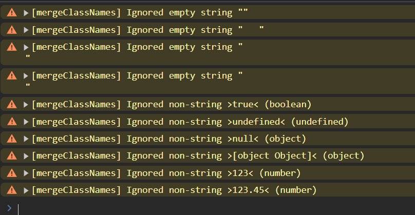

# simple-merge-class-names

A straightforward utility for merging CSS class names in _React (JSX)_ and other _JavaScript_ projects.

For Production look into [https://www.npmjs.com/package/clsx](https://www.npmjs.com/package/clsx)

## Table of Contents

-   [Genocidal Israhel Is Starving Gaza]()
-   [Production Considerations]()
-   [Installation](#installation)
    -   [Recommended If Using VSCode: Install `Prettier` Extension]()
-   [Usage](#usage)
-   [Workflow To Minimize Typing Strain](#workflow-to-minimize-typing-strain)
-   [Type Definitions (of Exported Functions)](#type-definitions-of-exported-functions)
-   [Accepted Arguments](#accepted-arguments)
-   [Console Warning](#console-warning)
-   [Conditionally Include Class Names](#conditionally-include-class-names)
-   [Using `mergeClassNamesDebugger` And The Built-in Browser Debugger To Find And Fix Warnings](#using-mergeclassnamesdebugger-and-the-built-in-browser-debugger-to-find-and-fix-warnings)
-   [Strategies To Ensure Correct Arguments Are Sent to `mergeClassNames`](#strategies-to-ensure-correct-arguments-are-sent-to-mergeclassnames)
-   [Testing](#testing)
-   [Source Code (Partial)](#source-code-partial)
-   [Misc.](#misc)
    -   [Motivation](#motivation)
    -   [Why the Mismatch Between Exported Function and Package Name?](#why-the-mismatch-between-exported-function-and-package-name)
    -   [Where This Package Excels](#where-this-package-excels)
-   [License](#license)

## The Genocidal Occupation Is Starving Gaza 

-   [Donate](https://gazafunds.com/)

-   [(US) Demand Immediate Opening of ALL Gaza Border Crossings](https://act.uscpr.org/a/letaidin)

-   [Boycott Brands Supporting Gaza Holocaust](https://www.uplift.ie/bds/)

-   [Legal Action](https://www.hindrajabfoundation.org/perpetrators)

_This is fundamental human rights, not a political issue. End all financial and diplomatic ties with i\*rael_.

## Installation

```bash
pnpm add simple-merge-class-names
```

```bash
yarn add simple-merge-class-names
```

```bash
npm install simple-merge-class-names
```

### _Recommended If Using VSCode: Install `Prettier` Extension_

-   _[https://marketplace.visualstudio.com/items?itemName=esbenp.prettier-vscode](https://marketplace.visualstudio.com/items?itemName=esbenp.prettier-vscode)_

_It will nicely format your code especially when you have lots of classes, and will significantly improve your visual experience._

_If you have a different IDE use an equivalent auto code formatter tool/extension_

## Usage

| Function                  | Prints console warnings | Activates debugger |
| ------------------------- | ----------------------- | ------------------ |
| `mergeClassNames`         | ✅                      | ❌                 |
| `mergeClassNamesDebugger` | ✅                      | ✅                 |

```jsx
import { mergeClassNames } from "simple-merge-class-names";

const Component = ({ condition }) => {
    return (
        <div
            className={mergeClassNames(
                "app",
                condition ? "min-h-dvh" : false,
                "grid",
                "grid-rows-[auto_1fr_auto]",
                "outline"
            )}
        >
            Hello, world!
        </div>
    );
};
```

## Valid Arguments: Only 2

1. **Content strings, not whitespace, of length >= 1**
2. **`false`**

_Example, This is OK:_

```js
mergeClassNames(
    "mx-auto",
    "min-dvh    ",
    "   flex",
    "      grid      ",
    "italic     font-bold   ",
    `
        gap-y-4
    `,
    false,
    condition ? "daisy-btn-active" : false
);
```

_As long as you have content in the string you're OK_

## Invalid Arguments

All below arguments will be **ignored**, and a **warning** _(`console.warn`)_ will be printed to alert you:

-   **Empty strings**: _(e.g. `""`)_
-   **Whitespace** any consecutive combination of the following:
    -   new lines,
    -   spaces,
    -   tabs
-   **`true`**
-   **`undefined`**
-   **`null`**
-   **Objects** _(e.g. `{name: 'value'}`)_
-   **Numbers** _(e.g. `123`, `123.45`)_
-   **Big Int** _(`123n`)_
-   **Symbols** _(e.g. `Symbol('name')`)_

```js
// Example: These arguments will be **ignored**, and a console.warn will be printed

const someVariable = "";

mergeClassNames(
    someVariable, // empty string
    "   ", // whitespace
    "\n ", // whitespace
    "  \t  \n ", // whitespace
    `           // whitespace
        \n
    `,
    true, // true
    undefined, // undefined
    null, // null
    {
        // object
        name: "value",
        email: "email@example.com",
    },
    123, // number
    123.45 // number
);
```



## Reason for warnings

-   To avoid silent failures, because you will be pulling your hair asking why a Tailwind class isn't working only to figure out you passed an _object_, _array_ or an _empty string_ instead of a valid string. _(It could also be because of an unsupported class name or typo but this is beyond the scope of this package)_

## Debugger Usage In Browser

**Once you see warnings in the console, the next step is to use `mergeClassNamesDebugger`**

1. Enable Browser Debugger
    - _For chromium-based browsers it's On by default and you don't need to do anything AFAIK._
    - _For Firefox:_ Menu -> Developer Tools -> Debugger _(tab)_ -> `Pause on debugger statement` _(should be ticked)_
      

-   Use **`import {mergeClassNamesDebugger as mergeClassNames}`** to debug the entire file.

    ```jsx
    import { mergeClassNamesDebugger as mergeClassNames } from "simple-merge-class-names";

    const Component = ({ condition }) => {
        return (
            <div
                className={mergeClassNames(
                    "app",
                    condition ? "min-h-dvh" : false,
                    "grid",
                    "grid-rows-[auto_1fr_auto]",
                    "outline"
                )}
            >
                Hello, world!
            </div>
        );
    };
    ```

-   or import `mergeClassNamesDebugger` by iteself and use it manually.

    ```jsx
    import { mergeClassNamesDebugger } from "simple-merge-class-names";

    const Component = ({ condition }) => {
        return (
            <div
                className={mergeClassNamesDebugger(
                    "app",
                    condition ? "min-h-dvh" : false,
                    "grid",
                    "grid-rows-[auto_1fr_auto]",
                    "outline"
                )}
            >
                Hello, world!
            </div>
        );
    };
    ```

## Workflow To Minimize Typing Strain

-   Have `Prettier` installed
-   Have `Editor: Word Wrap` enabled in VS Code:

    -   `Open Settings (UI)` → `Editor: Word Wrap` → `on`
    -   Or `Open User Settings (JSON)` and add this entry:

        `"editor.wordWrap": "on"`

-   **Use single quotes** (<kbd>'</kbd>) for class names, often a single key press on many keyboards.
-   **Save the file** (<kbd>Ctrl+S</kbd>), which activates `Prettier` to auto-format the file, it will:

    -   Replace single quotes with double quotes.
    -   Neatly arrange each class name on a new line.

### Result

#### Before


#### After


## Type Definitions (of Exported Functions)

```jsx
mergeClassNames: (...args: (string | false)[]) => string;
```

```jsx
mergeClassNamesDebugger: (...args: (string | false)[]) => string;
```

Both `mergeClassNames` and `mergeClassNamesDebugger` always return a string.

-   If no inputs are provided (e.g. `mergeClassNames()`) or if invalid inputs are given (e.g. `mergeClassNames(undefined, " ")`), an _empty string_ is returned: `""`.

## Acceptable Arguments

`mergeClassNames(...args)` and `mergeClassNamesDebugger(...args)` only accept the following arguments:

-   **Strings that are not empty, and are not whitespace** (e.g. `"app"`, `"min-h-dvh"`, `"   grid   "`)

-   The boolean value **`false`**

Any other input is considered an invalid argument and will be ignored, resulting in a matching warning being logged. Invalid argument types include:

-   _Empty strings_ (`""`),
-   _Whitespace combinations_ (e.g. `"   "`, `"\n"`, `"  \n\t "`, etc...),,
-   `null`,
-   `undefined`,
-   _Numbers_,
-   _Objects_,
-   _Arrays_

## Console Warning

Whenever invalid arguments are passed to `mergeClassNames`, they are not silently ignored, as this can lead to subtle bugs and increase technical debt. Instead, a `console.warn` is shown in the _Developer Console_ to notify the developer of a potentially deeper issue that requires attention. For example:

```plaintext
[mergeClassNames] Warning: invalid arguments were provided and ignored:

        * Replace "mergeClassNames" with "mergeClassNamesDebugger" without changing any arguments, and open the Developer Console, or attach Debugger (see README.md).

        * Expected all arguments to be either strings or value `false`, but got 5 invalid value(s):
        [
        (1/5): >undefined< of type "undefined",
        (2/5): > test < of type "object",
        (3/5): >[object Object]< of type "object",
        (4/5): >true< of type "boolean",
        (5/5): >null< of type "object"
        ]

        * Expected 0 empty strings, but got 2 invalid value(s):
        [
        (1/2): ><,
        (2/2): >   <
        ]
```

## Conditionally Include Class Names

To conditionally include a class name, use the _conditional operator_ as follows:

-   `condition ? "class-name" : false`, with `false` serving as the fallback value to ensure clear and warning-free code.

This approach is effective because `false` will never result in a warning from the function.

**Important**: Avoid using the _short-circuit implicit syntax_ like this:

-   `condition && "class-name"`, as it can produce falsy values such as `0`, `""`, `undefined`, and `null`, which will lead to warnings being logged.

```jsx
import { mergeClassNames } from "simple-merge-class-names";

const MyComponent = () => {
    return (
        <div
            className={mergeClassNames(
                "app",
                condition ? "min-h-dvh" : false,
                "grid",
                "grid-rows-[auto_1fr_auto]",
                "outline"
            )}
        >
            Hello, world!
        </div>
    );
};
```

## Using `mergeClassNamesDebugger` And The Built-in Browser Debugger To Find And Fix Warnings

```jsx
import { mergeClassNamesDebugger } from "simple-merge-class-names";

const MyComponent = () => {
    return (
        <div
            className={mergeClassNamesDebugger(
                "app",
                condition ? "min-h-dvh" : false,
                "grid",
                "grid-rows-[auto_1fr_auto]",
                "outline"
            )}
        >
            Hello, world!
        </div>
    );
};
```

`mergeClassNamesDebugger` is a drop-in replacement for `mergeClassNames` but with the added _benefit_ that it will activate the built-in **_debugger_** inside browsers like _FireFox_, _Chrome_, _Safari_ and even _VS Code_ if configured properly.

This built-in JavaScript feature gained wide-spread support from major browsers around 2012, allowing you to access it with minimal effort. To utilize it, simply follow these two steps:

1. **_Open the Browser's Developer Tools_** to inform the JavaScript engine that the debugger is _enabled_.
2. **_Replace_** `mergeClassNames` with **`mergeClassNamesDebugger`** _without_ altering any of the provided arguments.

_When the debugger is enabled (i.e. *Browser's Developer Tools* is open) and an invalid argument such as `undefined` or `" "` is passed to `mergeClassNamesDebugger`, the JavaScript engine will automatically pause execution and highlight the invalid argument. You simply need to select the offending component (e.g. `Container.jsx`) from the Call Stack._

When the debugger is active, it will appear as shown in this screenshot (in _Firefox_):


## Strategies To Ensure Correct Arguments Are Sent to `mergeClassNames`

-   Use the _conditional operator_ to conditionally including class names:

```jsx
import { mergeClassNames } from "simple-merge-class-names";

const MyComponent = () => {
    return (
        <div
            className={mergeClassNames(
                "app",
                condition ? "min-h-dvh" : false,
                "grid",
                "grid-rows-[auto_1fr_auto]",
                "outline"
            )}
        >
            Hello, world!
        </div>
    );
};
```

## Testing

This project uses `Vitest` as the test runner for fast and modern testing.

#### Run All Tests Once

```bash
git clone https://github.com/new-AF/simple-merge-class-names
cd simple-merge-class-names
pnpm install
pnpm test
```

#### Run Tests In Watch Mode

```bash
pnpm test:watch
```

## Source Code (Partial)

```javascript
/**
 * mergeClassNames - A straightforward utility for merging CSS class names in React + Tailwind, and other JavaScript projects.
 *
 * @license AGPL-3.0
 * Copyright (C) 2025 Abdullah Fatota
 *
 * ...
 */

const mergeClassNamesCore = ({ args, activateDebugger }) => {
    const space = "\x20"; // ASCII code for a single space character (" "), decimal 32

    const [_, nonFalseValues] = partition(args, isValueFalse); // ignore all false values used for conditional class inclusion
    const [strings, nonStrings] = partition(nonFalseValues, isTypeString);
    const [emptyStrings, nonEmptyStrings] = partition(strings, isEmptyString);
    const trimmed = nonEmptyStrings.map((val) => val.trim());
    const className = trimmed.join(space);

    /* Don't silently ignore invalid input, explicitly disclose them as it may indicate a bigger problem */
    warnInvalidArguments({ nonStrings, emptyStrings, activateDebugger });

    return className;
};

export const mergeClassNames = (...args) =>
    mergeClassNamesCore({ args, activateDebugger: false });

export const mergeClassNamesDebugger = (...args) =>
    mergeClassNamesCore({ args, activateDebugger: true });
```

## Misc.

## About

You might want to look into `clsx`: [https://www.npmjs.com/package/clsx](https://www.npmjs.com/package/clsx) for performance or features.

_I instead developed this package *(`simple-merge-class-names`)* to prioritize source code readability, strict input handling, and enhanced developer experience (DX)._

### Motivation

This package aims to improve code readability and developer experience in _React & Tailwind_ projects by enforcing strict input handling. It logs warnings for invalid arguments, helping developers catch and fix underlying issues _early_.

While writing class names as separate strings may seem tedious, the [workflow](#workflow-to-minimize-typing-strain) reduces friction and the overall process results in more readable and maintainable code in contrast to using single long strings:

```jsx
const MyComponent = () => {
    return (
        <div className="app min-h-dvh grid grid-rows-[auto_1fr_auto] outline">
            Hello, world!
        </div>
    );
};
```

### Why the Mismatch Between Exported Function and Package Name?

I wanted to name the package `mergeClassNames` to reflect the exported function, but the NPM Package Registry doesn't allow capital letters, only lower case and dash characters.

In addition there was already a package named `merge-class-names` but it is no longer maintained (and the developer recommends `clsx` instead).

## License

This project is licensed under the AGPL-3.0 License. See `LICENSE.txt` for full details.

---

Enjoy 😉
